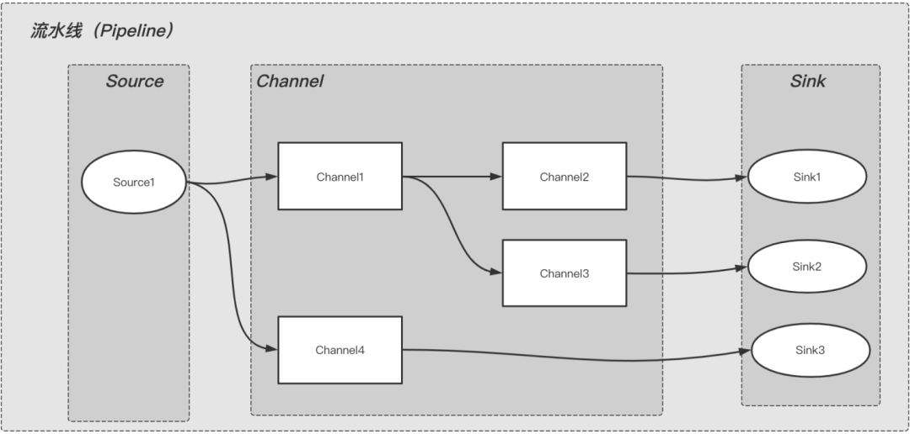

## pipline模式
### 目标
通过提供初始输入并传递处理后的输出以供下一阶段使用，从而允许在一系列阶段中进行数据处理。
### 解释
Pipeline模式为管道模式，也称为流水线模式。通过预先设定好的一系列的阶段来处理输入的数据，每个阶段的输出即是下一个阶段的输入。
### 模型图

从图中可以看出，整个流水线内数据流转是从上游到下游，上游的输出是下游的输入，按阶段依次执行。

Source: 表示数据来源，比如：KafkaSource。

Channel：表示对数据进行处理的组件，比如：JsonChannel，对数据进行json转换和处理。

Sink：表示数据落地或下沉的地方，比如：KafkaSink，表示数据发送到指定的kafka；DbSInk表示数据落地到DB。

可以看出，Pipeline是由Source（必须有），Channel（不一定需要），Sink（必须有）三种类型的组件自由组合而成的。